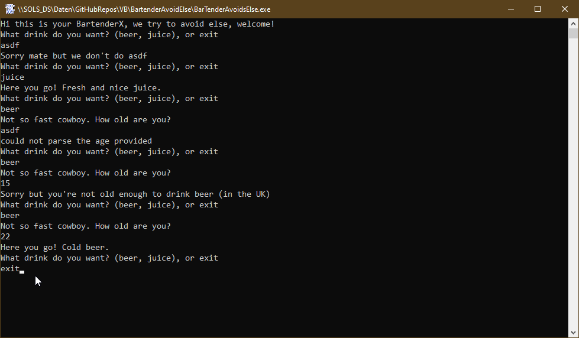

# Langg_AvoidElse  
## How and why to avoid the else keyword    

 

Project started around Okt.2022.  
This is the vbc-version of a code by Nick Chapsas. I like the tutorial-videos by Nick very much.  

[Link text Here](https://link-url-here.org)  

